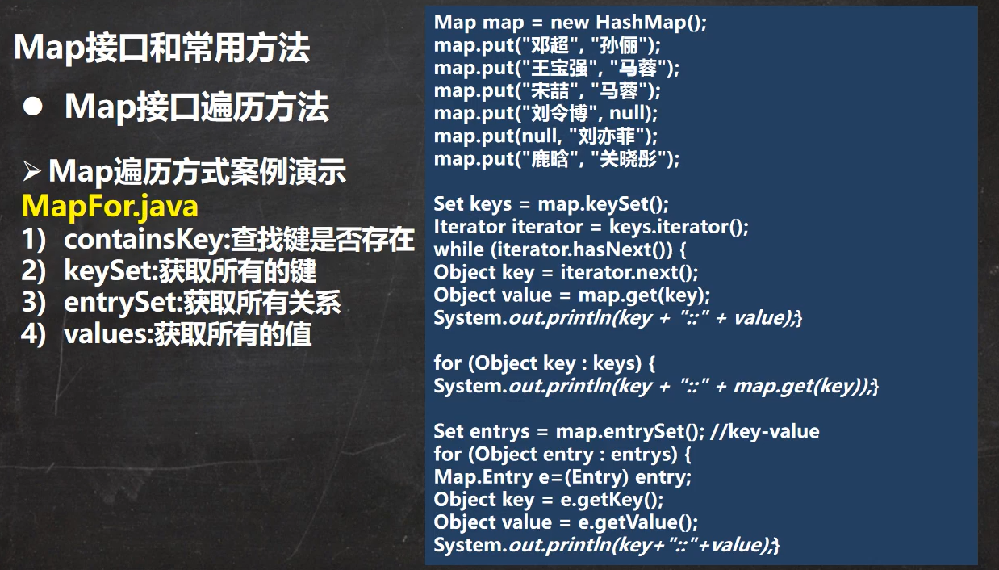

# study
study

#### finalize
1. 对象被回收时，系统自动调用该对象的finalize方法，

#### 面向对象
##### 三大特征
8.10  方法重载和重写
 1. 重载发生在本类，方法名必须一样，形参类型，个数或顺序至少有一个不同
 2. 重写发生在父子类，方法名相同，形参相同，子类重写的方法返回类型和父类的返回类型一致或是其子类，不能缩小父类的访问范围。
8.11 多态
 1. 方法或对象具有多种形态。是面向对象的第三大特征，多态是建立在封装和继承基础之上的。

10.3 代码块 codeblock
1. static代码块也叫静态代码块
2. ``类什么时候被加载``
  - 创建对象实例时（new）。
  - 创建子类对象实例，父类也会被加载。
  - 使用类的静态成员变量时（静态属性，静态方法）。
3. 普通的代码块，在创建对象时，会被隐式的调用。
4. 创建一个对象时，在一个类调用顺序是：
   1. 调用静态代码块和静态属性初始化（两者调用的优先级一样，如果有多个，则按照定义顺序调用）.
   2. 调用普通代码块和普通属性的初始化（同上）。
   3. 调用构造方法.
5. 构造器的最前面隐含了super()和调用普通代码
6. 创建子类对象时（继承关系）,他们的静态代码块，静态属性，普通代码快，普通属性初始化顺序：
   1. 父类的静态代码块和静态属性.
   2. 子类的静态代码块和静态属性。
   3. 父类的普通代码块和普通属性初始化。
   4. 父类的构造方法。
   5. 子类的普通代码快和普通属性初始化。
   6. 子类的构造方法。

10.4 设计模式 design_mode
1. 单例（懒汉式和饿汉式）
   1. 区别：
      1. 饿汉式一旦加载，就把单例实例化，保证getInstance的时候，单例是已经存在的（类加载时就创建实例）；可用于多线程，不存在线程安全问题；存在资源浪费。
      2. 懒汉式，只有当调用getInstance的时候才去初始化这个实例（使用时才创建）；本身是非线程安全的(双检锁解决并发问题)。
      3. 饿汉式在类创建的同时实例化一个静态对象出来，无论以后是否使用该单例，都会占用一定的内存，但相应地，由于其资源已初始化，第一次调用的速度也会更快。
懒汉式，会延迟加载，在第一次使用本单例时才会出现实例对象，第一次调用时要做初始化，如果要做的工作比较多，性能会有些延迟，以后就像饿汉式一样。

10.6 抽象类

14.12.3 map接口遍历方法

具体参考MapFor类。